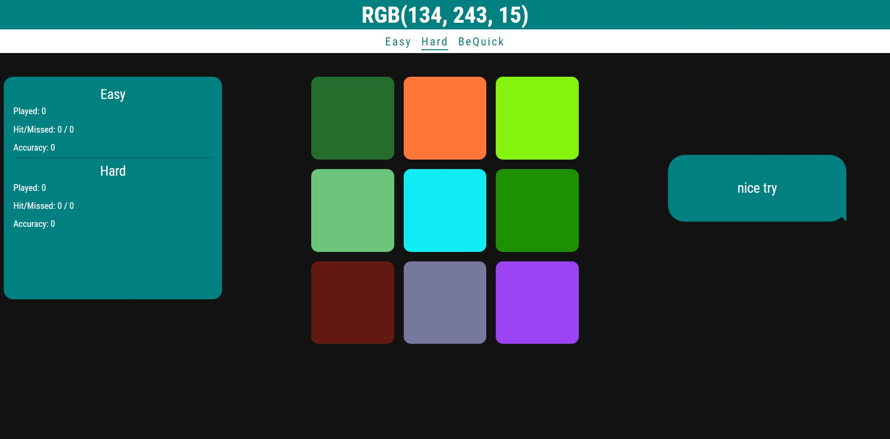

# Guess The Color

This is my attempt at creating a Guess The Color game.
It contains 3 game modes (Easy, Hard, BeQuick).
Easy and Hard are using lives to determine the loss.
Bequick uses time to determine progress, the player is rewarded with extra time for each correct guess and in punished in time loss after a mistake. 
It also gives the player harder levels based on his progress.

### Screenshot

### Links

- Solution URL: [https://github.com/DBryja/GuessTheColor]
- Live Site URL: [https://dbryja.github.io/GuessTheColor/]

## Author

- Twitter - [@D_Bryja](https://www.twitter.com/D_Bryja)
